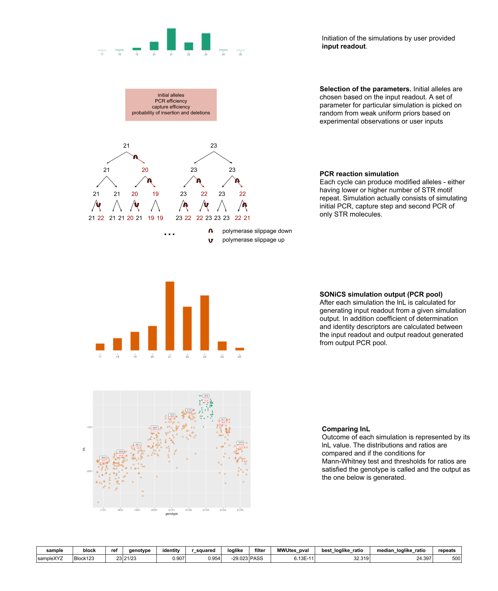

# SONiCS - Stutter mONte Carlo Simulation

## SUMMARY

SONiCS performs dense forward simulations of the PCR of Short Tandem Repeats from capture experiments, calculates the likelihood of generating the provided read support (reads per allele) out of the final PCR pool and determines the most probable genotype based on the log likelihood distributions from all such simulations.

## REQUIREMENTS

* Python version >= 3.4
* Cython
* Python modules:
  * numpy,
  * pandas,
  * scipy

### pymc
Earlier versions of sonics required pymc, which stopped being supported as it evolved into PyMC3. Unfortunately, the new version was missing the one function I needed so I copied it into `pymc_extracted.f` file which is being compiled during installation. 

### conda

I added an environment file that holds all the requirements for sonics. I recommend installing conda environment from this file, as it should make sure that installation of sonics will be successful.

```bash
conda env create -f conda_env.yml
```

This will install all requirements and allow running sonics in the `sonics_env` environment.

*[Conda](https://docs.conda.io/projects/conda/en/latest/index.html) is an open-source package management system and environment management system that runs on Windows, macOS, and Linux. Conda quickly installs, runs, and updates packages and their dependencies.* I would recommend [installing Miniconda](https://docs.conda.io/projects/conda/en/latest/user-guide/install/) - which comes with less pre-installed packages than Anaconda.

## INSTALLATION

The install.sh script checks for all the dependencies and requirements, and informs the user if a package is not installed. The user should provide the path to the version of python3 that they want SONiCS to use, in cases where more than one version of python3 is installed. At the end, the install.sh script runs a simple test and reports on whether everything is working as expected. Run the install.sh  script as follows:


If there's conda `sonics_env`:

```bash
conda activate sonics_env
bash install.sh 
```

otherwise you might need to provide path to Python3:

```bash
bash install.sh [PATH_TO_PYTHON3]
```

## RUNNING SONiCS

```bash
#example run
python3 sonics "8|5;9|113;10|89"
```

## DESCRIPTION

SONiCS - Stutter mONte Carlo Simulation.



SONiCS is a stutter correction algorithm for STR datasets generated using target capture. Briefly, SONiCS models independent PCR reactions where set of reaction parameters including the efficiency of amplification, efficiency of capture, and the probability of polymerase slippage modeled separately for insertions and deletions are drawn from weak uniform priors based on experimental observations or user inputs. Initial alleles are chosen randomly. For each simulation sonics assigns log-likelihood (lnL) value describing the probability of generating the input readout from the PCR pool generated in a given simulation. When a certain predetermined number of simulations are completed, Mann-Whitney U test between the lnL distributions is performed and lnL ratios are calculated (for maximal and 75th percentile values). If specified conditions on those tests are not met SONiCS performs additional simulations until the maximum number of repetitions is reached, or it can call a genotype that passes all filters. In the end the program reports the called genotype together with descriptors of the best model. SONiCS can also be run in strictly Monte Carlo mode (with the option --monte_carlo), which is further described below.

### INPUT

SONiCS accepts either (a) a string that enumerates the read support for the various repeat counts in the following format: allele1|reads;allele2|reads;allele3|reads or (b) a **VCF file** with one genotype per line and genotypes for samples in the consecutive columns starting with 9th.

Examples:

* string: "5|1;6|1;7|5;8|11;9|20;10|24;11|2;12|1"
* VCF file (lorem_ipsum marks additional information that can be in the file but won't be used)

```
#CHROM  POS     ID      REF     ALT     QUAL    FILTER  INFO    FORMAT  sample1    sample2    
genotype1 1001    .       GTGTGTGTGTGTGTGTGTGT    GTGTGTGTGTGTGTGTGTGTGT  0       .       END=1020;MOTIF=GT;LOREM_IPSUM=1;REF=10;LOREM_IPSUM=9;LOREM_IPSUM=11 GT:ALLREADS:LOREM_IPSUM    1/1:-2|1;0|54;2|914;4|15:lorem_ipsum   0/0:-6|2;-4|22;-2|150;0|1215;2|11:lorem_ipsum  
```

### OUTPUT

The output is saved to sonics_out.txt file in the output directory. It has the following columns:
* sample, block and reference for the locus;
* genotype called by sonics;
* descriptors: identity, r^2 and log likelihood of the best model;
* filter column - possible values:
	*  PASS - all conditions are met;
	*  no_simulations - SONiCS did not run any simulations, only one allele in the input readout;
	*  no_success - none of the simulations generated a PCR pool from which the input readout could be generated (this can happen with very noisy genotypes, increasing the noise ratio might help in those cases);
	*  MWU_test - p-value from Mann-Whitney U test was above the threshold;
	*  best_ratio - ratio of the best log-likelihoods from two best genotypes was below the threshold;
	*  median_ratio - ratio of the median log-likelihoods from two best genotypes was below the threshold.
* highest p-value from Mann-Whitney U test;
* ratio between maximal log-likelihood (lnL) of the two best genotypes;
* ratio between 75th percentile lnL of the two best genotypes;
* number of run repetitions.
* additional ratios calculated.

```
head sonics_out.txt
sample  block   ref     genotype        identity        r_squared       lnL     filter  MWUtes_pval     best_lnL_ratio  median_lnL_ratio        repeats additional_ratios
sampleXYZ  Block123   .       9/10    0.9178743961352657      0.9586113691329956      -7.930843070149422      PASS    9.86432656589e-11       59.7759855255   66.4114566904   100     0.5|79.19670724088837;0.8|65.61195204472192;0.9|66.41145669038094

```

#### Monte Carlo mode

The output is saved to sonics_out.txt file in the output directory. It has the following columns:
* sample, block and reference for the locus;
* genotype called by sonics;
* descriptors - their best and 75th percentile values: identity, r^2 and log-likelihood of the best model;
* number of run repetitions.

```
sample  block   ref     genotype        identity        identity_75th_percentile        r_squared       r_squared_75th_percentile       lnL     lnL_75th_percentile     repeats
sampleXYZ  Block123   .       9/10    0.893719806763285       0.8985507246376812      0.88215172290802        0.9494138956069946      -5.635919340653118      -13.885656443890184     1000
```

### MODES

#### Monte Carlo
Another approach to calling genotypes from capture datasets is to try to run a large number of simulations that saturate the parameter space and then pick the genotype that has the highest likelihood at varying quantiles of the distributions. SONiCS implements this approach, and it can be invoked by using the --monte_carlo option.

#### Saving all simulations
SONiCS can store the parameters and descriptors from all simulations. When run with **--save_report** it will dump the full report (with one simulation parameters and descriptors per line) into a csv file in the output directory.

#### Choosing starting alleles
SONiCS can choose input alleles randomly or half randomly - one allele is always the one with the highest support. By default sonics run in half_random mode, that can be changed to random by specifying **--random**.

#### Support for partial alleles
* **-t, --strict n_strict** - Action when encountered with partial repetitions of the motif in the VCF file. Options: 0 - pick on random one of the closest alleles, 1 - exclude given STR, 2 -exclude given genotype. Default: 1

*Example:*
REF=11, MOTIF=GT, GT=0|54;1|27;2|914;4|15
* 0: 11|81;12|914;13|15 or 11|54;12|941;13|15
* 1: 11|54;12|914;13|15
* 2: exclude genotype from simulation pool

### PARAMETERS FOR SIMULATIONS

* **-r, --repetitions n_repetitions** - maximum number of repetitions per genotype, default: 1000
* **-y, --pcr_cycles n_pcr_cycles** - number of PCR cycles before introducing the capture step; default: 12
* **-c, --after_capture n_after_capture** - number of PCR cycles after the introduction of the capture step; default: 12
* **-p, --padjusted p_adjust_threshold** - threshold for Bonferroni corrected p-value of Mann Whitney U test of the log-likelihood distributions; default: 0.01
* **-i, --lnL_threshold lnL_threshold** - threshold for max and 75th percentile lnL ratios
* **--add_ratios** - Semicolon separated additional ratios to be calculated and reported in the last column of the output file.
Example: 0.5;0.6;0.8;0.9 means that median, 60th, 80th and 90th lnL percentile ratios will be calculated and reported.

### PARAMETERS SPECIFIC FOR PCR

Parameters are chosen on random from the given open interval before each simulation.

* **-e, --efficiency N N** - PCR efficiency default: (0.001, 0.1)
* **-d, --down N N** - probability of slippage down - synthesizing molecule with lower repeat counts; default: (0, 0.1)
* **-u, --up N N** - probability of slippage up - synthesizing molecule with higher repeat counts; default: (0, 0.1)
* **-k, --capture N N** - parameter describing efficiency of the capture step. Values below zero favor capturing shorter molecules; default: (-0.25, 0.25)
* **--up_preference** - up-stutter doesn't have to be more probable than down-stutter; default slippage_down > slippage_up
* **-f, --floor n_floor** - Parameter used in calculating the minimum number of STRs in a molecule for it to be included in PCR cycles. Default: 5

*Formula:*
min_strs = max(1, min(alleles_in_input) - n_floor)

where: alleles_in_input are expressed as the number of repetitions of the motif and n_floor is a parameter defined by this option. If set to -1 minimum  number of STRs set to 1.


### ALL OPTIONS

```
usage: sonics [-h] [-o out_path] [-n file_name] [-p n_processes] [-t n_strict]
              [-y n_pcr_cycles] [-c n_after_capture] [-b block_id]
              [-a sample_name] [-r n_repetitions] [-g p_adjust_threshold]
              [-i lnL_threshold] [-s n_star_copies] [-l noise_threshold]
              [-f n_floor] [--min_sim min_sim] [-j n_one_allele_threshold]
              [-e MIN MAX] [-d MIN MAX] [-u MIN MAX] [-k MIN MAX]
              [--add_ratios ratios] [-m] [--monte_carlo] [--random]
              [--save_report] [--up_preference] [-v] [--version]
              INPUT

SONiCS - Stutter mONte Carlo Simulation. SONiCS is a stutter correction
algorithm based on derivative of Monte Carlo approach. Briefly, SONiCS models
independent PCR reactions where set of reaction parameters including the
efficiency of amplification, efficiency of capture, and the probability of
polymerase slippage modeled separately for insertions and deletions are drawn
from weak uniform priors based on experimental observations or user inputs.
Initial alleles are chosen randomly. For each simulation sonics assigns log-
likelihood (lnL) value describing the probability of generating the input
readout from the PCR pool created in a given simulation. When a certain number
of simulations are generated Mann-Whitney U test between the lnL distributions
is performed and lnL ratios are calculated (for maximal and 75th percentile
values). If the conditions of the successful run are not met SONiCS performs
additional simulations until the maximum number of repetitions is reached, or
it can call a genotype. As a result, program reports the called genotype
together with descriptors of the best model. SONiCS can also be run in
strictly Monte Carlo mode (with the option --monte_carlo). For more look in
the README file.

positional arguments:
  INPUT                 Either:allele composition - number of reads per
                        allele, example: all1|reads;all2|reads or path to a
                        VCF file if run with --vcf_mode option

optional arguments:
  -h, --help            show this help message and exit
  -o out_path, --out_path out_path
                        Directory where output files will be stored. Warning:
                        SONiCS will overwrite results from previous runs
                        stored in the same directory if the file name won't be
                        changed. Default: .
  -n file_name, --file_name file_name
                        Output file name. Default: sonics_out.txt
  -p n_processes, --processes n_processes
                        Number of sub-processes used in multiprocessing mode.
                        It can be understood as additional processes lunched
                        by the main sonics process and 0 means that SONiCS
                        won't lunch additional processes. This option is valid
                        only in VCF mode. Default: 0
  -t n_strict, --strict n_strict
                        What to do when encountered partial repetitions of the
                        motif while parsing the VCF file. Options: 0 - pick on
                        random one of the closest alleles, 1 - exclude given
                        STR, 2 - exclude given genotype. Default: 1
  -y n_pcr_cycles, --pcr_cycles n_pcr_cycles
                        Number of PCR cycles before introducing capture step.
                        Default: 12
  -c n_after_capture, --after_capture n_after_capture
                        How many cycles of PCR amplification were performed
                        after introducing capture step. Default: 12
  -b block_id, --block block_id
                        Block name, valid only with string genotype as input.
                        Default: Block
  -a sample_name, --name sample_name
                        Sample name, valid only with string genotype as input.
                        Default: sample
  -r n_repetitions, --repetitions n_repetitions
                        Number of maximum repetitions in the simulations.
                        Default: 1000
  -g p_adjust_threshold, --padjust p_adjust_threshold
                        Adjusted p-value threshold for selecting the allele.
                        Default: 0.001
  -i lnL_threshold, --lnL_threshold lnL_threshold
                        Log-likelihood (lnL) ratio threshold. Default: 2.3
  -s n_star_copies, --start_copies n_star_copies
                        Number of start copies. Default: 300000
  -l noise_threshold, --noise_threshold noise_threshold
                        How much noise should be added? Noise shouldn't
                        comprise more than the maximum fraction threshold of
                        the initial PCR pool (before first amplification).
                        Default: 0.05
  -f n_floor, --floor n_floor
                        Parameter used in calculating the minimum number of
                        STRs in a molecule for it to be included in PCR
                        cycles. The formula stands as follows: min_strs =
                        max(1, min(alleles_in_input) - n_floor), where alleles
                        are expressed as the number of repetitions of the
                        motif and n_floor is a parameter defined by this
                        option. If set to -1 minimum number of STRs set to 1.
                        Default: 5
  --min_sim min_sim     Minimum of successful simulation per run in order to
                        run tests on log-likelihood values. If there minimum
                        number of successful simulations is not reached,
                        SONiCS returns no_success in Filter column. This may
                        happen if a) the simulations are run without adding
                        noise, b) maximum number of simulations is too small
                        to satisfy the minimumfor successful simulations per
                        genotype. c) combination of both. Default: 25
  -j n_one_allele_threshold, --one_allele n_one_allele_threshold
                        Number of reads supporting only one allele for it to
                        be included in the output. Default: 45
  -e MIN MAX, --efficiency MIN MAX
                        PCR efficiency before-after per cycle, i.e.
                        probability of the amplification. Default: (0.001,
                        0.1)
  -d MIN MAX, --down MIN MAX
                        Per unit probability of down-slippage - generating a
                        molecule with lower repeat count (min and max).
                        Default: (0, 0.1)
  -u MIN MAX, --up MIN MAX
                        Per unit probability of up-slippage - generating a
                        molecule with more repeats (min and max). Default: (0,
                        0.1)
  -k MIN MAX, --capture MIN MAX
                        Capture parameter (min and max). Values below zero
                        favor capturing short alleles. Default: (-0.25, 0.25)
  --add_ratios ratios   Semicolon separated additional ratios to be calculated
                        and reported in the last column of the output file.
                        Example: 0.5;0.6;0.8;0.9 - median, 60th, 80th and 90th
                        lnL percentile ratios will be calculated and reported.
  -m, --vcf_mode        VCF file provided. Assuming that different samples, if
                        more than one is present, are put in the consecutive
                        columns, starting with 10th. Default: string mode.
  --monte_carlo         Run SONiCS in Monte Carlo mode. Increased number of
                        repetitions recommended
  --random              Randomly select alleles for simulations from the
                        input. Default: randomly select only one of the
                        alleles, the other is chosen based on the support
                        information from input.
  --save_report         Save full report - including the parameters for each
                        simulation. The files will be named with block and
                        sample name, and stored in the output directory.
  --up_preference       Up-stutter doesn't have to be less probable than down
                        stutter. Default: probability of down-stutter must be
                        higher than the probability of up-stutter.
  -v, --verbose         Verbose mode.
  --version             show program's version number and exit

```
